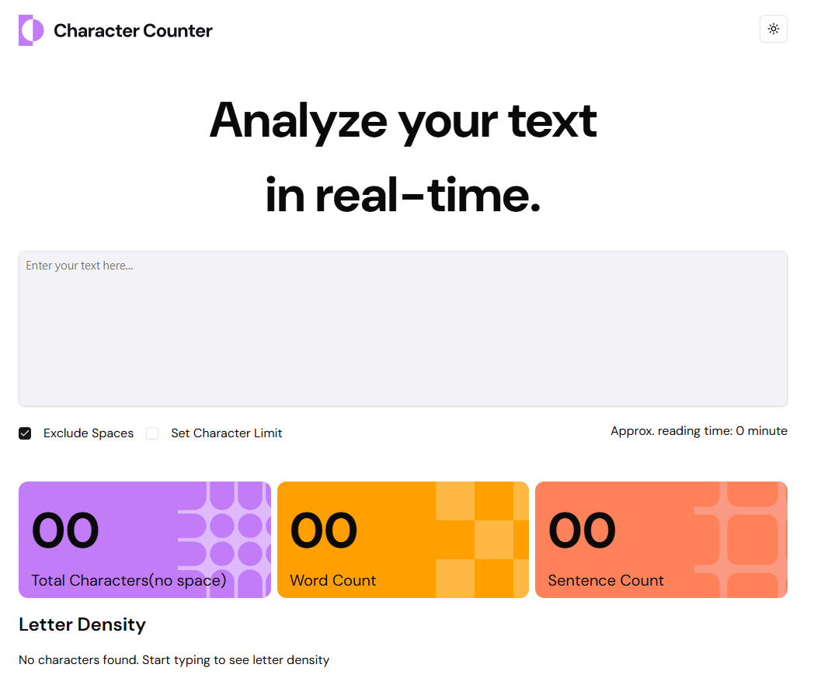

# Text Analyzer

## Table of Contents

- [Overview](#overview)
- [Screenshot](#screenshot)
- [Links](#links)
- [Built With](#built-with)

## Overview

Text Analyzer is a real-time text analysis tool that provides instant metrics on character count, word count, sentence count, and character frequency distribution. The application offers a clean, modern interface with both light and dark theme options.

### Key Features

- Real-time text analysis as you type
- Character counting with option to exclude spaces
- Word and sentence counting
- Character frequency visualization with sortable results
- Character limit tracking
- Light/Dark mode toggle
- Responsive design

## Screenshot

## Links

- [Live Site URL](https://terrysu418.github.io/Frontend-Mentor-character-counter/)
- [Repository URL](https://github.com/TerrySu418/Frontend-Mentor-character-counter)

## Built With

- React.js
- TypeScript
- Tailwind CSS

### Technical Details

- State management using React hooks (useState, useEffect)
- Real-time text analysis with optimized rendering
- Custom formatting and data processing functions
- Responsive layout using Tailwind CSS utility classes

### Component Structure

- `App.tsx` - Main application component with state management
- `CharFrequencyList` - Displays character frequency analysis
- `CharacterLimitForm` - Handles text input and space exclusion toggle
- `ModeToggle` - Manages theme switching between light and dark modes

### Color Scheme

- Purple (#8B5CF6) - Character count section
- Yellow (#EAB308) - Word count section
- Orange (#F97316) - Sentence count section
- Dynamic theming with light and dark mode support
  "# Frontend-Mentor-character-counter"
